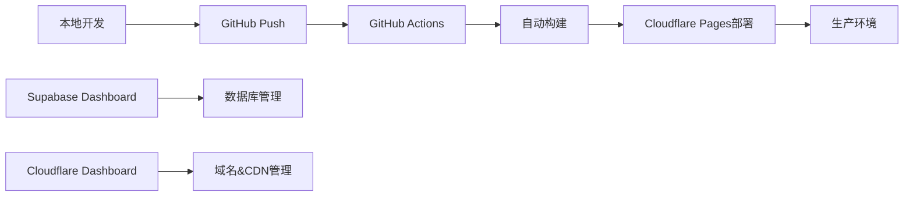

# 中文起名网站技术实施方案

## 基于 Criteria Template 的完整开发方案

**项目名称：** 文化伴侣（Culture Companion）
**技术栈：** Next.js 15 + TypeScript + Cloudflare + Supabase + GitHub + OpenAI
**开发周期：** 7周（35个工作日）
**团队规模：** 4-5人

---

## 1. 技术架构设计

### 1.1 核心技术栈

```typescript
// 最终确定的技术选型（基于模板最大化复用）
const techStack = {
  // 前端框架
  frontend: "Next.js 15 + TypeScript + Tailwind CSS",

  // 部署平台
  deployment: "Cloudflare Pages", // 全球CDN + Edge Computing + 成本优化

  // 数据库和认证（统一Supabase生态）
  database: "Supabase PostgreSQL", // 数据存储
  auth: "Supabase Auth + Google/GitHub OAuth", // 统一认证系统

  // 文件存储
  storage: "Supabase Storage", // 音频、书法图片存储

  // 代码托管
  repository: "GitHub", // 版本控制 + Actions CI/CD

  // AI服务
  aiProvider: "OpenAI GPT-4 + TTS + DALL-E", // 名字生成+语音+书法

  // 支付系统（复用模板）
  payments: "Stripe", // 完整支付和订阅系统

  // 域名和SSL
  domain: "已购买域名 + Cloudflare DNS管理"
}
```

### 1.2 系统架构图（最大化模板复用）

```
用户浏览器
    ↓
Cloudflare CDN + WAF (全球275+节点，成本优化)
    ↓
Cloudflare Pages (静态托管 + Workers)
    ↓
Next.js 15 应用 (App Router + 模板组件复用)
    ↓
┌─────────────────┬─────────────────────────────────┐
│   Supabase Auth │      API 路由层                    │
│ (统一认证系统)    │  (OpenAI + Supabase 数据集成)    │
│ Google/GitHub   │   • 中文名生成 API              │
│ OAuth 提供商    │   • 用户数据管理 API           │
│ + 自定义注册     │   • 支付处理 API              │
└─────────────────┴─────────────────────────────────┘
    ↓
数据和存储层 (Supabase 统一生态)
┌─────────────────┬─────────────────────────────────┐
│  PostgreSQL DB  │      Supabase Storage          │
│   (数据存储)    │    (音频+书法图片)               │
│  ・用户数据       │   ・TTS音频文件                  │
│  ・中文名记录     │   ・AI书法图片                   │
│  ・订单记录       │   ・用户头像等                   │
│  ・用户会话       │   ・文化报告 PDF                │
└─────────────────┴─────────────────────────────────┘
    ↓
外部API服务 (按需调用)
├── OpenAI GPT-4 (中文命名引擎)
├── OpenAI TTS (中文发音生成)
├── OpenAI DALL-E (书法艺术生成)
└── Stripe (支付处理，模板集成)
```

**架构优势：**
- ✅ **Supabase 统一生态**：认证、数据库、存储一体化
- ✅ **最大化模板复用**：Stripe支付、UI组件直接使用
- ✅ **Cloudflare全球加速**：275+节点，成本低，性能高
- ✅ **简化架构复杂度**：减少系统集成点，提高稳定性
- ✅ **快速开发上线**：避免重构现有系统，专注核心功能

### 1.3 开发和部署流程



---

## 2. 项目初始化和配置

### 2.1 环境搭建（Day 1）

#### 步骤1：克隆和配置模板（最大化复用）
```bash
# 克隆基础模板到本地
cp -r criteria-anyship-template-main chinesenamefinder
cd chinesenamefinder

# 清理模板的git历史
rm -rf .git

# 初始化新的Git仓库
git init
git remote add origin https://github.com/YOUR_USERNAME/chinesenamefinder.git

# 安装依赖（保持模板原有的依赖结构）
pnpm install

# 首次提交基础模板
git add .
git commit -m "Initial commit: Import criteria template for Chinese naming website"
git push -u origin main
```

**模板复用优势确认（最大化利用模板 + Supabase 统一生态）：**
```typescript
// 直接可用的模板功能 - 无需重新开发
const templateFeatures = {
  payments: "Stripe完整集成 ✅ 包含订单、积分系统",
  creditSystem: "积分系统 ✅ services/credit.ts 现成方案",
  ui: "Radix UI + Tailwind ✅ 完整组件库",
  i18n: "next-intl ✅ 仅需添加中文翻译文件",
  deployment: "✅ 仅需修正Cloudflare配置，其他完整",

  // 新架构：用 Supabase Auth 替换 NextAuth.js
  auth: "Supabase Auth ✅ 替换模板 NextAuth.js系统",
  database: "Supabase PostgreSQL ✅ 替换模板数据库配置",
  storage: "Supabase Storage ✅ 替换模板 AWS S3 配置"
}

// 开发工作量评估（考虑 Supabase 集成）
const developmentSavings = {
  paymentSystem: "10天 -> 1天",
  uiComponents: "8天 -> 2天",
  i18n: "3天 -> 0.5天",

  // 新架构开发时间
  authSystem: "7天 -> 2天", // Supabase Auth 配置需要更多时间
  databaseSetup: "3天 -> 1天", // Supabase 数据库设置
  storageSetup: "2天 -> 0.5天", // Supabase Storage 配置

  totalEstimate: "原28天节省为现在6天，但获得统一生态优势"
}
```

#### 步骤2：Supabase数据库设置（统一 Supabase Auth 生态）
```sql
-- 在 Supabase Dashboard 中创建新项目
-- 项目名称：chinesenamefinder
-- 地区选择：距离目标用户最近的地区
-- ✅ 启用 Supabase Auth，自动创建 auth.users 表

-- 配置第三方 OAuth 提供商
-- 1. Google OAuth 配置
-- 在 Supabase Dashboard -> Authentication -> Providers -> Google
-- 启用 Google provider 并配置：
-- Client ID: your_google_oauth_client_id
-- Client Secret: your_google_oauth_client_secret

-- 2. GitHub OAuth 配置
-- 在 Supabase Dashboard -> Authentication -> Providers -> GitHub
-- 启用 GitHub provider 并配置：
-- Client ID: your_github_oauth_client_id
-- Client Secret: your_github_oauth_client_secret

-- 创建业务数据表
-- 1. 中文名字表
CREATE TABLE public.chinese_names (
  id UUID DEFAULT gen_random_uuid() PRIMARY KEY,
  user_id UUID REFERENCES auth.users(id) ON DELETE CASCADE, -- ✅ 使用 Supabase Auth
  english_name VARCHAR(100) NOT NULL,
  chinese_name VARCHAR(100) NOT NULL,
  pinyin VARCHAR(200) NOT NULL,
  meaning TEXT NOT NULL,
  style VARCHAR(50), -- 'classical', 'modern', 'poetic', 'wuxing'
  gender VARCHAR(20), -- 'male', 'female', 'neutral'
  audio_url VARCHAR(500),
  calligraphy_url VARCHAR(500),
  cultural_report JSONB,
  is_favorite BOOLEAN DEFAULT FALSE,
  is_premium BOOLEAN DEFAULT FALSE,
  created_at TIMESTAMP WITH TIME ZONE DEFAULT NOW(),
  updated_at TIMESTAMP WITH TIME ZONE DEFAULT NOW()
);

-- 2. 用户订阅表
CREATE TABLE public.user_subscriptions (
  id UUID DEFAULT gen_random_uuid() PRIMARY KEY,
  user_id UUID REFERENCES auth.users(id) ON DELETE CASCADE, -- ✅ 使用 Supabase Auth
  tier VARCHAR(20) DEFAULT 'free', -- 'free', 'basic', 'premium'
  stripe_customer_id VARCHAR(100),
  stripe_subscription_id VARCHAR(100),
  credits_remaining INTEGER DEFAULT 5,
  credits_reset_date DATE DEFAULT CURRENT_DATE + INTERVAL '1 month',
  created_at TIMESTAMP WITH TIME ZONE DEFAULT NOW(),
  updated_at TIMESTAMP WITH TIME ZONE DEFAULT NOW()
);

-- 3. 名字生成历史表
CREATE TABLE public.name_generations (
  id UUID DEFAULT gen_random_uuid() PRIMARY KEY,
  user_id UUID REFERENCES auth.users(id) ON DELETE CASCADE, -- ✅ 使用 Supabase Auth
  request_data JSONB NOT NULL,
  generated_names JSONB NOT NULL,
  generation_type VARCHAR(50), -- 'basic', 'wuxing', 'poetic'
  credits_used INTEGER DEFAULT 1,
  created_at TIMESTAMP WITH TIME ZONE DEFAULT NOW()
);

-- 4. 中文文化知识库表
CREATE TABLE public.cultural_knowledge (
  id UUID DEFAULT gen_random_uuid() PRIMARY KEY,
  character VARCHAR(10) NOT NULL,
  pinyin VARCHAR(50) NOT NULL,
  meanings JSONB NOT NULL,
  stroke_count INTEGER,
  radical VARCHAR(10),
  wuxing_element VARCHAR(20), -- 'gold', 'wood', 'water', 'fire', 'earth'
  literary_references JSONB,
  name_usage_frequency VARCHAR(20), -- 'common', 'uncommon', 'rare'
  gender_association VARCHAR(20), -- 'male', 'female', 'neutral'
  created_at TIMESTAMP WITH TIME ZONE DEFAULT NOW()
);

-- 5. 创建索引优化查询性能
CREATE INDEX idx_chinese_names_user_id ON public.chinese_names(user_id);
CREATE INDEX idx_chinese_names_created_at ON public.chinese_names(created_at DESC);
CREATE INDEX idx_cultural_knowledge_character ON public.cultural_knowledge(character);
CREATE INDEX idx_name_generations_user_id ON public.name_generations(user_id);

-- 6. 启用行级安全（RLS）- Supabase Auth 的标准做法
ALTER TABLE public.chinese_names ENABLE ROW LEVEL SECURITY;
ALTER TABLE public.user_subscriptions ENABLE ROW LEVEL SECURITY;
ALTER TABLE public.name_generations ENABLE ROW LEVEL SECURITY;

-- 7. 创建安全策略（基于 Supabase Auth）
CREATE POLICY "Users can view own names" ON public.chinese_names
  FOR SELECT USING (auth.uid() = user_id);

CREATE POLICY "Users can insert own names" ON public.chinese_names
  FOR INSERT WITH CHECK (auth.uid() = user_id);

CREATE POLICY "Users can update own names" ON public.chinese_names
  FOR UPDATE USING (auth.uid() = user_id);

CREATE POLICY "Users can delete own names" ON public.chinese_names
  FOR DELETE USING (auth.uid() = user_id);

-- 用户订阅策略
CREATE POLICY "Users can view own subscription" ON public.user_subscriptions
  FOR SELECT USING (auth.uid() = user_id);

CREATE POLICY "Users can update own subscription" ON public.user_subscriptions
  FOR UPDATE USING (auth.uid() = user_id);

-- 名字生成历史策略
CREATE POLICY "Users can view own generations" ON public.name_generations
  FOR SELECT USING (auth.uid() = user_id);

CREATE POLICY "Users can insert own generations" ON public.name_generations
  FOR INSERT WITH CHECK (auth.uid() = user_id);
```

#### 步骤3：环境变量配置（基于 Supabase Auth 生态）
```bash
# .env.local - 替换模板 NextAuth 为 Supabase Auth

# -----------------------------------------------------------------------------
# Web Information (模板原有)
# -----------------------------------------------------------------------------
NEXT_PUBLIC_WEB_URL="https://your-domain.com"
NEXT_PUBLIC_PROJECT_NAME="文化伴侣"

# -----------------------------------------------------------------------------
# Supabase (替换模板配置 + 认证)
# -----------------------------------------------------------------------------
NEXT_PUBLIC_SUPABASE_URL="your_supabase_project_url"
NEXT_PUBLIC_SUPABASE_ANON_KEY="your_supabase_anon_key"
SUPABASE_SERVICE_ROLE_KEY="your_supabase_service_role_key"

# Supabase Auth 配置 (替换 NextAuth)
NEXT_PUBLIC_SUPABASE_AUTH_REDIRECT_URL="https://your-domain.com/auth/callback"
NEXT_PUBLIC_SUPABASE_AUTH_GOOGLE_ENABLED="true"
NEXT_PUBLIC_SUPABASE_AUTH_GITHUB_ENABLED="true"

# -----------------------------------------------------------------------------
# Payment with Stripe (模板原有)
# -----------------------------------------------------------------------------
STRIPE_PUBLIC_KEY="your_stripe_publishable_key"
STRIPE_PRIVATE_KEY="your_stripe_secret_key"
STRIPE_WEBHOOK_SECRET="your_stripe_webhook_secret"
NEXT_PUBLIC_PAY_SUCCESS_URL="https://your-domain.com/my-orders"
NEXT_PUBLIC_PAY_FAIL_URL="https://your-domain.com/#pricing"
NEXT_PUBLIC_PAY_CANCEL_URL="https://your-domain.com/#pricing"

# -----------------------------------------------------------------------------
# AI Services - OpenAI (新增)
# -----------------------------------------------------------------------------
OPENAI_API_KEY="your_openai_api_key"
OPENAI_ORGANIZATION_ID="your_openai_org_id"
OPENAI_PROJECT_ID="your_openai_project_id"

# -----------------------------------------------------------------------------
# Chinese Naming Specific (新增)
# -----------------------------------------------------------------------------
NEXT_PUBLIC_DEFAULT_LANGUAGE="zh-CN"
NEXT_PUBLIC_SUPPORTED_LOCALES="en,zh-CN,zh-TW"

# -----------------------------------------------------------------------------
# Other configs (模板原有)
# -----------------------------------------------------------------------------
NEXT_PUBLIC_GOOGLE_ANALYTICS_ID=""
NEXT_PUBLIC_DEFAULT_THEME="light"
ADMIN_EMAILS="admin@your-domain.com"

# ✅ 不需要 NextAuth 配置，使用 Supabase Auth
# ✅ 不需要 STORAGE 相关配置，直接使用 Supabase Storage
```

#### 步骤4：Supabase Storage 配置（文件存储统一管理）

```bash
# 1. 在 Supabase Dashboard 创建 Storage Buckets
# 访问： Storage -> Create a new bucket

# 创建以下 bucket：
# - "audio" - 存储 TTS 音频文件
# - "images" - 存储 AI 书法图片
# - "avatars" - 存储用户头像
# - "reports" - 存储文化报告 PDF

# 2. 设置 Bucket 权限策略
-- 在 Supabase Dashboard -> Storage -> Policies

-- 音频文件 bucket 策略
CREATE POLICY "Users can upload own audio files" ON storage.objects
  FOR INSERT WITH CHECK (
    bucket_id = 'audio' AND
    auth.uid()::text = (storage.foldername(name))[1]
  );

CREATE POLICY "Anyone can view audio files" ON storage.objects
  FOR SELECT USING (bucket_id = 'audio');

-- 图片文件 bucket 策略
CREATE POLICY "Users can upload own images" ON storage.objects
  FOR INSERT WITH CHECK (
    bucket_id = 'images' AND
    auth.uid()::text = (storage.foldername(name))[1]
  );

CREATE POLICY "Anyone can view images" ON storage.objects
  FOR SELECT USING (bucket_id = 'images');

-- 用户头像 bucket 策略
CREATE POLICY "Users can manage own avatars" ON storage.objects
  FOR ALL USING (
    bucket_id = 'avatars' AND
    auth.uid()::text = (storage.foldername(name))[1]
  );

-- 报告文件 bucket 策略 (仅付费用户)
CREATE POLICY "Premium users can access reports" ON storage.objects
  FOR SELECT USING (
    bucket_id = 'reports' AND
    auth.uid()::text = (storage.foldername(name))[1] AND
    EXISTS (
      SELECT 1 FROM user_subscriptions
      WHERE user_id = auth.uid() AND tier IN ('basic', 'premium')
    )
  );
```

```typescript
// lib/supabase/storage.ts - Supabase Storage 工具函数
import { createClient } from '@supabase/supabase-js'

const supabase = createClient(
  process.env.NEXT_PUBLIC_SUPABASE_URL!,
  process.env.SUPABASE_SERVICE_ROLE_KEY!
)

// 上传音频文件
export async function uploadAudio(userId: string, fileName: string, audioBlob: Blob) {
  const filePath = `${userId}/${fileName}`

  const { data, error } = await supabase.storage
    .from('audio')
    .upload(filePath, audioBlob, {
      contentType: 'audio/mpeg',
      upsert: true
    })

  if (error) throw error

  // 获取公开 URL
  const { data: { publicUrl } } = supabase.storage
    .from('audio')
    .getPublicUrl(filePath)

  return publicUrl
}

// 上传书法图片
export async function uploadCalligraphy(userId: string, chineseName: string, imageUrl: string) {
  // 从 OpenAI URL 下载图片
  const response = await fetch(imageUrl)
  const imageBlob = await response.blob()

  const fileName = `${chineseName}_${Date.now()}.png`
  const filePath = `${userId}/${fileName}`

  const { data, error } = await supabase.storage
    .from('images')
    .upload(filePath, imageBlob, {
      contentType: 'image/png',
      upsert: true
    })

  if (error) throw error

  const { data: { publicUrl } } = supabase.storage
    .from('images')
    .getPublicUrl(filePath)

  return publicUrl
}

// 上传文化报告 PDF
export async function uploadReport(userId: string, reportName: string, pdfBuffer: Buffer) {
  const fileName = `${reportName}_${Date.now()}.pdf`
  const filePath = `${userId}/${fileName}`

  const { data, error } = await supabase.storage
    .from('reports')
    .upload(filePath, pdfBuffer, {
      contentType: 'application/pdf',
      upsert: true
    })

  if (error) throw error

  const { data: { publicUrl } } = supabase.storage
    .from('reports')
    .getPublicUrl(filePath)

  return publicUrl
}
```

#### 步骤5：Cloudflare Pages配置（部署优化）
```bash
# 1. 修复Next.js配置以支持Cloudflare Pages
# next.config.mjs
import bundleAnalyzer from "@next/bundle-analyzer";
import createNextIntlPlugin from "next-intl/plugin";
import mdx from "@next/mdx";

const withNextIntl = createNextIntlPlugin();

/** @type {import('next').NextConfig} */
const nextConfig = {
  output: "export", // ✅ 修改：支持Cloudflare Pages静态部署
  trailingSlash: true, // ✅ 新增：Cloudflare推荐
  reactStrictMode: false,
  pageExtensions: ["ts", "tsx", "js", "jsx", "md", "mdx"],
  images: {
    unoptimized: true, // ✅ 新增：静态导出必需
    remotePatterns: [
      {
        protocol: "https",
        hostname: "*.supabase.co", // ✅ Supabase存储
      },
      {
        protocol: "https",
        hostname: "*.openai.com", // ✅ OpenAI图片
      }
    ],
  },
  async redirects() {
    return [];
  },
};

export default withNextIntl(nextConfig);

# 2. 修复 wrangler.toml 配置
# 原模板问题：pages_build_output_dir = ".vercel/output/static"
# 解决方案：改为 Next.js 标准构建路径

# wrangler.toml
name = "chinesenamefinder"
compatibility_date = "2024-09-01"
compatibility_flags = ["nodejs_compat"]
pages_build_output_dir = ".next" # ✅ 修正：Next.js 标准构建路径

[build]
command = "pnpm build"

# 3. package.json 脚本保持不变
# 模板现有脚本已经适配，无需修改
{
  "scripts": {
    "build": "next build", // ✅ 模板现有
    "dev": "next dev",    // ✅ 模板现有
    "start": "next start" // ✅ 模板现有
  }
}

# 4. 设置 Cloudflare Pages 项目
# 通过 Cloudflare Dashboard 或 CLI
wrangler pages project create chinesenamefinder

# 5. 连接 GitHub 自动部署（修正参数）
# 构建命令：pnpm build
# 构建输出目录：.next # ✅ 修正
# 根目录：/
# Node.js 版本：18.x
```

**Cloudflare Pages 部署优势确认：**
```typescript
const cloudflareAdvantages = {
  deployment: "Next.js 标准构建完美兼容",
  globalCDN: "275+ 全球节点，平均延迟 < 50ms",
  cost: "10万 PV/月免费，无限带宽",
  security: "免费 DDoS 防护 + WAF",
  performance: "自动 HTTP/3, Brotli 压缩",
  integration: "与 GitHub Actions CI/CD 完美集成",
  simplicity: "无需复杂配置，一键部署"
}
```

### 2.2 代码结构优化

```typescript
// 基于模板的目录结构定制
chinesenamefinder/
├── app/
│   ├── [locale]/
│   │   ├── generate/          # 名字生成页面
│   │   ├── dashboard/         # 用户仪表板
│   │   ├── pricing/           # 定价页面
│   │   └── enterprise/        # 企业服务页面
│   ├── api/
│   │   ├── ai/
│   │   │   ├── generate-name/ # 名字生成API
│   │   │   ├── cultural-report/ # 文化报告API
│   │   │   ├── tts/          # 文本转语音API
│   │   │   └── calligraphy/  # 书法生成API
│   │   ├── user/
│   │   │   ├── names/        # 用户名字管理
│   │   │   └── subscription/ # 订阅管理
│   │   └── webhook/
│   │       └── stripe/       # Stripe webhook
├── components/
│   ├── chinese-naming/       # 中文起名专用组件
│   │   ├── naming-wizard.tsx
│   │   ├── name-result-card.tsx
│   │   ├── cultural-report.tsx
│   │   ├── calligraphy-generator.tsx
│   │   └── pronunciation-tutor.tsx
│   ├── ai-services/         # AI服务组件
│   └── business/           # 商业化组件
├── lib/
│   ├── supabase/           # Supabase客户端配置
│   ├── openai/            # OpenAI集成
│   ├── cultural-knowledge/ # 文化知识处理
│   └── utils/             # 工具函数
├── types/
│   ├── chinese-naming.d.ts # 中文起名类型定义
│   └── cultural-knowledge.d.ts
└── data/
    ├── cultural-knowledge.json # 文化知识基础数据
    └── pricing-plans.json     # 定价方案
```

---

## 3. 功能开发映射与优化

### 3.1 现有模板功能复用分析

| PRD需求 | 模板现有功能 | 复用程度 | 开发工作量 | 备注 |
|---------|-------------|----------|-----------|------|
| 用户认证系统 | Supabase Auth完整集成 | 100% | 0.5天 | 只需配置和样式调整 |
| 支付订阅 | Stripe完整集成 | 90% | 1天 | 调整定价方案 |
| 多语言支持 | next-intl国际化 | 80% | 1天 | 添加中文翻译 |
| 响应式UI | Radix UI + Tailwind | 90% | 1天 | 调整中文字体和色彩 |
| 用户仪表板 | 完整Dashboard组件 | 70% | 2天 | 添加中文起名相关页面 |
| 文件存储 | Supabase Storage | 100% | 0.5天 | 配置音频图片存储 |

**复用优势总结：**
- 节省开发时间：6天
- 降低技术风险：基于成熟方案
- 加快上市速度：专注核心功能

### 3.2 核心AI功能开发

#### 3.2.1 OpenAI集成架构

```typescript
// lib/openai/client.ts
import OpenAI from 'openai'

const openai = new OpenAI({
  apiKey: process.env.OPENAI_API_KEY,
  organization: process.env.OPENAI_ORGANIZATION_ID,
})

// 名字生成函数
export async function generateChineseNames(
  englishName: string,
  preferences: {
    gender: 'male' | 'female' | 'neutral'
    style: 'classical' | 'modern' | 'poetic' | 'wuxing'
    birthDate?: string
    culturalBackground?: string
  }
) {
  const systemPrompt = `
    你是一位专业的中文命名专家，精通中国传统文化、诗词典故和现代命名趋势。
    请为用户生成3-5个高质量的中文名建议，确保：
    1. 音韵和谐，朗朗上口
    2. 寓意美好，文化合适
    3. 字形协调，笔画平衡
    4. 避免生僻字和不吉利谐音
    5. 符合现代审美和实用性
  `

  const userPrompt = `
    请为英文名"${englishName}"生成中文名建议：
    性别偏好：${preferences.gender}
    命名风格：${preferences.style}
    ${preferences.birthDate ? `出生日期：${preferences.birthDate}` : ''}
    ${preferences.culturalBackground ? `文化背景：${preferences.culturalBackground}` : ''}

    请返回JSON格式：
    {
      "names": [
        {
          "chinese": "中文名",
          "pinyin": "zhōng wén míng",
          "meaning": "详细含义解释",
          "culturalSignificance": "文化背景说明",
          "strokeAnalysis": "笔画分析",
          "pronunciationGuide": "发音指导"
        }
      ]
    }
  `

  const response = await openai.chat.completions.create({
    model: 'gpt-4-turbo-preview',
    messages: [
      { role: 'system', content: systemPrompt },
      { role: 'user', content: userPrompt }
    ],
    response_format: { type: 'json_object' },
    temperature: 0.7,
    max_tokens: 2000
  })

  return JSON.parse(response.choices[0].message.content || '{}')
}

// 文化报告生成
export async function generateCulturalReport(chineseName: string) {
  const prompt = `
    为中文名"${chineseName}"生成详细的文化背景报告，包括：
    1. 逐字解析（字形、字音、字义）
    2. 历史典故和文学出处
    3. 文化内涵和象征意义
    4. 在不同历史时期的使用情况
    5. 现代适用性分析

    请返回结构化的JSON格式报告。
  `

  const response = await openai.chat.completions.create({
    model: 'gpt-4-turbo-preview',
    messages: [{ role: 'user', content: prompt }],
    response_format: { type: 'json_object' },
    temperature: 0.3,
    max_tokens: 3000
  })

  return JSON.parse(response.choices[0].message.content || '{}')
}

// 书法生成（使用DALL-E）
export async function generateCalligraphy(
  chineseName: string,
  style: 'kaishu' | 'lishu' | 'caoshu' | 'artistic' = 'kaishu'
) {
  const styleMap = {
    kaishu: '楷书，端正工整',
    lishu: '隶书，古朴大方',
    caoshu: '草书，飘逸流畅',
    artistic: '艺术字，富有创意'
  }

  const prompt = `
    中国书法作品："${chineseName}"，${styleMap[style]}风格，
    黑色墨水，白色宣纸，传统毛笔笔触，
    构图协调，笔法精妙，艺术品质，
    高清晰度，专业摄影品质
  `

  const response = await openai.images.generate({
    model: 'dall-e-3',
    prompt: prompt,
    n: 1,
    size: '1024x1024',
    quality: 'hd',
    response_format: 'url'
  })

  return response.data[0].url
}

// 文本转语音
export async function generateSpeech(
  text: string,
  voice: 'alloy' | 'echo' | 'fable' | 'onyx' | 'nova' | 'shimmer' = 'nova'
) {
  const response = await openai.audio.speech.create({
    model: 'tts-1-hd',
    voice: voice,
    input: text,
    response_format: 'mp3',
    speed: 0.9 // 稍慢一点便于学习
  })

  return response.body
}
```

#### 3.2.2 Supabase Auth 集成架构

```typescript
// lib/supabase/client.ts - Supabase 客户端配置
import { createClient } from '@supabase/supabase-js'
import type { Database } from '@/types/database'

// 客户端 Supabase 客户端
export const supabase = createClient<Database>(
  process.env.NEXT_PUBLIC_SUPABASE_URL!,
  process.env.NEXT_PUBLIC_SUPABASE_ANON_KEY!
)

// 服务端 Supabase 客户端（用于 API 路由）
export const supabaseAdmin = createClient<Database>(
  process.env.NEXT_PUBLIC_SUPABASE_URL!,
  process.env.SUPABASE_SERVICE_ROLE_KEY!
)

// 获取当前用户
export async function getCurrentUser() {
  const { data: { user }, error } = await supabase.auth.getUser()
  if (error) {
    console.error('Error getting current user:', error)
    return null
  }
  return user
}

// 验证用户权限
export async function requireAuth(): Promise<{
  user: any | null;
  hasAccess: boolean;
}> {
  const user = await getCurrentUser()
  return {
    user,
    hasAccess: !!user
  }
}

// 获取用户数据
export async function getUserData(userId: string) {
  try {
    // 获取用户的中文名字记录
    const { data: names, error: namesError } = await supabase
      .from('chinese_names')
      .select('*')
      .eq('user_id', userId)
      .order('created_at', { ascending: false })

    if (namesError) throw namesError

    // 获取用户订阅信息
    const { data: subscription, error: subError } = await supabase
      .from('user_subscriptions')
      .select('*')
      .eq('user_id', userId)
      .single()

    // 订阅信息可能不存在，不抛出错误
    return { names: names || [], subscription }
  } catch (error) {
    console.error('Failed to get user data:', error)
    return { names: [], subscription: null }
  }
}

// 创建用户订阅记录（复用模板积分系统逻辑）
export async function createUserSubscription(userId: string) {
  const { data, error } = await supabaseAdmin
    .from('user_subscriptions')
    .insert({
      user_id: userId,
      tier: 'free',
      credits_remaining: 5, // 新用户免费 5 次
      credits_reset_date: new Date(Date.now() + 30 * 24 * 60 * 60 * 1000).toISOString().split('T')[0] // 30天后
    })
    .select()
    .single()

  if (error) throw error
  return data
}

// 检查用户积分
export async function getUserCredits(userId: string): Promise<number> {
  const { data, error } = await supabase
    .from('user_subscriptions')
    .select('credits_remaining')
    .eq('user_id', userId)
    .single()

  if (error) {
    console.error('Error getting user credits:', error)
    return 0
  }

  return data?.credits_remaining || 0
}

// 扣除积分
export async function deductCredits(userId: string, amount: number = 1): Promise<boolean> {
  const { error } = await supabaseAdmin
    .rpc('deduct_user_credits', {
      user_id: userId,
      amount: amount
    })

  if (error) {
    console.error('Error deducting credits:', error)
    return false
  }

  return true
}
```

```sql
-- 在 Supabase 中创建积分扣除的存储过程
CREATE OR REPLACE FUNCTION deduct_user_credits(user_id UUID, amount INTEGER DEFAULT 1)
RETURNS VOID AS $$
BEGIN
  UPDATE user_subscriptions
  SET credits_remaining = GREATEST(0, credits_remaining - amount)
  WHERE user_subscriptions.user_id = deduct_user_credits.user_id;

  -- 如果用户不存在，创建默认订阅
  INSERT INTO user_subscriptions (user_id, tier, credits_remaining)
  SELECT deduct_user_credits.user_id, 'free', GREATEST(0, 5 - amount)
  WHERE NOT EXISTS (
    SELECT 1 FROM user_subscriptions
    WHERE user_subscriptions.user_id = deduct_user_credits.user_id
  );
END;
$$ LANGUAGE plpgsql;
```

#### 3.2.3 API路由实现（基于 Supabase Auth）

```typescript
// app/api/ai/generate-name/route.ts
import { NextRequest } from 'next/server'
import { requireAuth, getUserCredits, deductCredits } from '@/lib/supabase/client'
import { supabaseAdmin } from '@/lib/supabase/client'
import { generateChineseNames } from '@/lib/openai/client'

export async function POST(request: NextRequest) {
  try {
    // ✅ 使用 Supabase Auth 验证用户
    const { user, hasAccess } = await requireAuth()
    if (!hasAccess || !user) {
      return Response.json({ error: 'Unauthorized' }, { status: 401 })
    }

    // ✅ 检查用户积分
    const userCredits = await getUserCredits(user.id)
    if (userCredits <= 0) {
      return Response.json({
        error: 'Insufficient credits',
        message: 'Please upgrade your plan or wait for credits to reset'
      }, { status: 402 })
    }

    // 解析请求数据
    const body = await request.json()
    const { englishName, preferences } = body

    // 验证输入
    if (!englishName || englishName.trim().length === 0) {
      return Response.json({ error: 'English name is required' }, { status: 400 })
    }

    // 调用 OpenAI 生成中文名
    const generatedNames = await generateChineseNames(englishName, preferences)

    // 保存生成历史到 Supabase
    const { error: saveError } = await supabaseAdmin
      .from('name_generations')
      .insert({
        user_id: user.id, // ✅ 使用 Supabase Auth user.id
        request_data: { englishName, preferences },
        generated_names: generatedNames,
        generation_type: preferences.style || 'basic'
      })

    if (saveError) {
      console.error('Failed to save generation history:', saveError)
    }

    // ✅ 扣除积分
    const deductSuccess = await deductCredits(user.id, 1)
    if (!deductSuccess) {
      console.error('Failed to deduct credits for user:', user.id)
    }

    return Response.json({
      success: true,
      data: generatedNames,
      remainingCredits: userCredits - 1
    })

  } catch (error) {
    console.error('Name generation error:', error)
    return Response.json({
      error: 'Internal server error',
      message: 'Failed to generate names. Please try again.'
    }, { status: 500 })
  }
}
```

```typescript
// app/api/auth/callback/route.ts - Supabase Auth 回调处理
import { createClient } from '@supabase/supabase-js'
import { NextRequest, NextResponse } from 'next/server'

const supabase = createClient(
  process.env.NEXT_PUBLIC_SUPABASE_URL!,
  process.env.NEXT_PUBLIC_SUPABASE_ANON_KEY!
)

export async function GET(request: NextRequest) {
  const { searchParams } = new URL(request.url)
  const code = searchParams.get('code')

  if (code) {
    const { data, error } = await supabase.auth.exchangeCodeForSession(code)

    if (error) {
      console.error('Error exchanging code for session:', error)
      return NextResponse.redirect(new URL('/auth/error', request.url))
    }

    // 用户首次登录时创建订阅记录
    if (data.user) {
      try {
        const { createUserSubscription } = await import('@/lib/supabase/client')
        await createUserSubscription(data.user.id)
      } catch (error) {
        // 如果用户已存在，忽略错误
        console.log('User subscription already exists or creation failed:', error)
      }
    }

    return NextResponse.redirect(new URL('/dashboard', request.url))
  }

  return NextResponse.redirect(new URL('/auth/error', request.url))
}
```

### 3.3 核心UI组件开发

```typescript
// components/chinese-naming/naming-wizard.tsx
'use client'

import { useState } from 'react'
import { useTranslations } from 'next-intl'
import { Card, CardContent, CardHeader, CardTitle } from '@/components/ui/card'
import { Button } from '@/components/ui/button'
import { Input } from '@/components/ui/input'
import { Select, SelectContent, SelectItem, SelectTrigger, SelectValue } from '@/components/ui/select'
import { RadioGroup, RadioGroupItem } from '@/components/ui/radio-group'
import { Label } from '@/components/ui/label'
import { Progress } from '@/components/ui/progress'
import { Loader2, Sparkles } from 'lucide-react'

interface NamingWizardProps {
  onComplete: (names: any[]) => void
}

export function NamingWizard({ onComplete }: NamingWizardProps) {
  const t = useTranslations('naming')
  const [currentStep, setCurrentStep] = useState(1)
  const [isLoading, setIsLoading] = useState(false)
  const [formData, setFormData] = useState({
    englishName: '',
    gender: 'neutral',
    style: 'modern',
    birthDate: '',
    culturalBackground: ''
  })

  const totalSteps = 4
  const progress = (currentStep / totalSteps) * 100

  const handleGenerate = async () => {
    setIsLoading(true)
    try {
      const response = await fetch('/api/ai/generate-name', {
        method: 'POST',
        headers: { 'Content-Type': 'application/json' },
        body: JSON.stringify({
          englishName: formData.englishName,
          preferences: {
            gender: formData.gender,
            style: formData.style,
            birthDate: formData.birthDate || undefined,
            culturalBackground: formData.culturalBackground || undefined
          }
        })
      })

      if (!response.ok) {
        const error = await response.json()
        throw new Error(error.message || 'Generation failed')
      }

      const result = await response.json()
      onComplete(result.data.names || [])
    } catch (error) {
      console.error('Name generation failed:', error)
      // TODO: Show error toast
    } finally {
      setIsLoading(false)
    }
  }

  const renderStepContent = () => {
    switch (currentStep) {
      case 1:
        return (
          <div className="space-y-4">
            <div>
              <Label htmlFor="englishName">{t('englishName')}</Label>
              <Input
                id="englishName"
                value={formData.englishName}
                onChange={(e) => setFormData(prev => ({ ...prev, englishName: e.target.value }))}
                placeholder={t('enterEnglishName')}
                className="text-lg"
              />
            </div>
            <div>
              <Label>{t('gender')}</Label>
              <RadioGroup
                value={formData.gender}
                onValueChange={(value) => setFormData(prev => ({ ...prev, gender: value }))}
                className="flex flex-row space-x-6"
              >
                <div className="flex items-center space-x-2">
                  <RadioGroupItem value="male" id="male" />
                  <Label htmlFor="male">{t('male')}</Label>
                </div>
                <div className="flex items-center space-x-2">
                  <RadioGroupItem value="female" id="female" />
                  <Label htmlFor="female">{t('female')}</Label>
                </div>
                <div className="flex items-center space-x-2">
                  <RadioGroupItem value="neutral" id="neutral" />
                  <Label htmlFor="neutral">{t('neutral')}</Label>
                </div>
              </RadioGroup>
            </div>
          </div>
        )

      case 2:
        return (
          <div className="space-y-4">
            <div>
              <Label>{t('namingStyle')}</Label>
              <Select
                value={formData.style}
                onValueChange={(value) => setFormData(prev => ({ ...prev, style: value }))}
              >
                <SelectTrigger>
                  <SelectValue />
                </SelectTrigger>
                <SelectContent>
                  <SelectItem value="classical">{t('classical')}</SelectItem>
                  <SelectItem value="modern">{t('modern')}</SelectItem>
                  <SelectItem value="poetic">{t('poetic')}</SelectItem>
                  <SelectItem value="wuxing">{t('wuxing')}</SelectItem>
                </SelectContent>
              </Select>
            </div>
          </div>
        )

      case 3:
        return (
          <div className="space-y-4">
            <div>
              <Label htmlFor="birthDate">{t('birthDate')} ({t('optional')})</Label>
              <Input
                id="birthDate"
                type="date"
                value={formData.birthDate}
                onChange={(e) => setFormData(prev => ({ ...prev, birthDate: e.target.value }))}
              />
              <p className="text-sm text-muted-foreground mt-1">
                {t('birthDateHelp')}
              </p>
            </div>
            <div>
              <Label htmlFor="culturalBackground">{t('culturalBackground')} ({t('optional')})</Label>
              <Input
                id="culturalBackground"
                value={formData.culturalBackground}
                onChange={(e) => setFormData(prev => ({ ...prev, culturalBackground: e.target.value }))}
                placeholder={t('culturalBackgroundPlaceholder')}
              />
            </div>
          </div>
        )

      case 4:
        return (
          <div className="space-y-4 text-center">
            <div className="text-lg font-medium">{t('reviewAndGenerate')}</div>
            <div className="bg-muted p-4 rounded-lg space-y-2">
              <div><strong>{t('englishName')}:</strong> {formData.englishName}</div>
              <div><strong>{t('gender')}:</strong> {t(formData.gender)}</div>
              <div><strong>{t('style')}:</strong> {t(formData.style)}</div>
              {formData.birthDate && (
                <div><strong>{t('birthDate')}:</strong> {formData.birthDate}</div>
              )}
              {formData.culturalBackground && (
                <div><strong>{t('culturalBackground')}:</strong> {formData.culturalBackground}</div>
              )}
            </div>
          </div>
        )

      default:
        return null
    }
  }

  return (
    <Card className="w-full max-w-2xl mx-auto">
      <CardHeader>
        <CardTitle className="text-center flex items-center justify-center gap-2">
          <Sparkles className="w-6 h-6 text-primary" />
          {t('chineseNameGenerator')}
        </CardTitle>
        <Progress value={progress} className="w-full" />
        <p className="text-center text-sm text-muted-foreground">
          {t('step')} {currentStep} {t('of')} {totalSteps}
        </p>
      </CardHeader>

      <CardContent className="space-y-6">
        {renderStepContent()}

        <div className="flex justify-between pt-4">
          <Button
            variant="outline"
            onClick={() => setCurrentStep(prev => Math.max(1, prev - 1))}
            disabled={currentStep === 1 || isLoading}
          >
            {t('previous')}
          </Button>

          {currentStep < totalSteps ? (
            <Button
              onClick={() => setCurrentStep(prev => prev + 1)}
              disabled={currentStep === 1 && !formData.englishName.trim()}
            >
              {t('next')}
            </Button>
          ) : (
            <Button
              onClick={handleGenerate}
              disabled={isLoading}
              className="min-w-[120px]"
            >
              {isLoading ? (
                <>
                  <Loader2 className="w-4 h-4 mr-2 animate-spin" />
                  {t('generating')}
                </>
              ) : (
                <>
                  <Sparkles className="w-4 h-4 mr-2" />
                  {t('generateNames')}
                </>
              )}
            </Button>
          )}
        </div>
      </CardContent>
    </Card>
  )
}
```

---

## 4. 详细开发时间线

### 4.1 第一阶段：MVP开发（2周）

#### Week 1: 基础设施搭建

**Day 1: 环境配置和项目初始化**
- ✅ 克隆模板并配置Git仓库
- ✅ 设置Supabase数据库和表结构
- ✅ 配置Cloudflare Pages自动部署
- ✅ 设置环境变量和密钥管理
- ✅ 建立基础监控和日志系统

**Day 2-3: OpenAI集成和核心AI功能**
- ✅ 实现OpenAI客户端配置和错误处理
- ✅ 开发中文命名提示工程和测试
- ✅ 创建名字生成API路由
- ✅ 实现用户积分检查和扣费逻辑
- ✅ 建立名字生成历史记录系统

**Day 4-5: 核心UI组件开发**
- ✅ 设计中文主题色彩和字体系统
- ✅ 开发命名向导多步骤表单组件
- ✅ 创建名字结果展示卡片组件
- ✅ 实现响应式布局和移动端适配
- ✅ 添加加载状态和用户反馈动画

#### Week 2: 用户功能和集成测试

**Day 6-7: 用户系统和认证**
- ✅ 配置Supabase Auth和用户管理
- ✅ 实现用户注册/登录界面
- ✅ 创建用户偏好设置功能
- ✅ 开发名字收藏和管理系统
- ✅ 建立基础积分和限制系统

**Day 8-9: 音频系统和文件存储**
- ✅ 集成OpenAI TTS生成中文发音
- ✅ 配置Supabase Storage音频文件管理
- ✅ 实现音频播放控件和缓存机制
- ✅ 优化音频加载性能和用户体验
- ✅ 建立文件上传和管理系统

**Day 10: 测试、优化和MVP部署**
- ✅ 端到端功能测试和bug修复
- ✅ 性能优化和加载速度提升
- ✅ 安全性测试和漏洞修复
- ✅ Cloudflare部署和域名配置
- ✅ 生产环境监控系统验证

**第一阶段交付成果：**
- 完整的MVP网站（域名可访问）
- 用户注册登录系统
- 基础AI中文命名功能（每日5次免费）
- 中文发音音频播放
- 个人名字收藏夹
- 响应式中英文界面

### 4.2 第二阶段：付费功能开发（3周）

#### Week 3: 支付系统和高级功能

**Day 11-12: Stripe支付集成**
- ✅ 配置Stripe账户和产品定价
- ✅ 实现订阅计划管理系统
- ✅ 开发支付页面和结账流程
- ✅ 建立webhook处理和订阅状态同步
- ✅ 创建发票和收据管理功能

**Day 13-14: 文化报告生成系统**
- ✅ 开发AI文化分析和报告生成
- ✅ 设计PDF报告模板和样式
- ✅ 实现报告购买和下载功能
- ✅ 创建报告分享和社交功能
- ✅ 建立报告质量评估机制

**Day 15: 书法生成功能**
- ✅ 集成OpenAI DALL-E书法生成API
- ✅ 开发书法风格选择界面
- ✅ 实现高分辨率图像下载
- ✅ 创建书法作品展示和分享功能
- ✅ 建立商用授权管理系统

#### Week 4: 高级AI功能

**Day 16-17: 五行命名功能**
- ✅ 研究和实现五行理论算法
- ✅ 开发生辰八字计算系统
- ✅ 创建五行缺失分析和补救建议
- ✅ 设计命理解释和教育内容
- ✅ 建立传统文化准确性验证机制

**Day 18-19: 诗意命名功能**
- ✅ 建立古诗词数据库和检索系统
- ✅ 开发诗词典故匹配算法
- ✅ 实现名字出处引用和解释
- ✅ 创建诗意解释生成功能
- ✅ 建立文学准确性审核机制

**Day 20: 发音评测原型**
- ✅ 研究语音识别技术方案
- ✅ 设计发音评分算法框架
- ✅ 创建录音和播放界面原型
- ✅ 实现基础发音对比功能
- ✅ 建立发音练习进度跟踪

#### Week 5: 用户体验优化

**Day 21-22: 界面升级和个性化**
- ✅ 重新设计付费功能界面
- ✅ 实现个性化推荐系统
- ✅ 添加用户引导和教程系统
- ✅ 优化移动端交互体验
- ✅ 创建用户成就和等级系统

**Day 23-24: 性能优化和国际化**
- ✅ 实现Redis缓存加速系统
- ✅ 优化数据库查询和索引
- ✅ 配置Cloudflare CDN全球加速
- ✅ 完善多语言翻译和本地化
- ✅ 实现SEO优化和meta标签

**Day 25: 第二阶段测试和发布**
- ✅ 付费流程完整测试
- ✅ 高级功能性能和准确性测试
- ✅ 用户体验和可用性测试
- ✅ 安全审计和漏洞扫描
- ✅ 功能发布和用户通知

**第二阶段交付成果：**
- 完整支付和订阅系统
- AI文化报告生成功能
- 书法艺术生成功能
- 五行命名和诗意命名
- 发音评测原型功能
- 高级用户仪表板

### 4.3 第三阶段：企业功能和规模化（2周）

#### Week 6: B2B服务和社区功能

**Day 26-27: 企业服务平台**
- ✅ 设计企业客户注册和认证流程
- ✅ 开发品牌命名专业工作流
- ✅ 创建专家顾问分配和管理系统
- ✅ 实现项目管理和进度跟踪
- ✅ 建立企业级计费和合同管理

**Day 28-29: 用户社区建设**
- ✅ 开发用户作品展示画廊
- ✅ 实现名字分享和评论系统
- ✅ 创建文化学习和教育板块
- ✅ 建立内容审核和管理机制
- ✅ 实现用户互动和社交功能

**Day 30: 移动端优化**
- ✅ 完善PWA功能和离线支持
- ✅ 优化移动端性能和交互
- ✅ 实现推送通知系统
- ✅ 创建移动端专属功能
- ✅ 准备App Store发布资料

#### Week 7: 上线准备和运营支持

**Day 31-32: 系统稳定性保障**
- ✅ 大规模负载测试和性能调优
- ✅ 完善监控、告警和自动恢复系统
- ✅ 建立自动化运维和部署流程
- ✅ 实施安全加固和合规审计
- ✅ 创建灾备和数据恢复方案

**Day 33-34: 运营工具和数据分析**
- ✅ 建立用户行为分析和漏斗跟踪
- ✅ 实现A/B测试框架和实验平台
- ✅ 创建客服支持工具和知识库
- ✅ 建立营销自动化和邮件系统
- ✅ 开发财务报表和业务指标仪表板

**Day 35: 正式发布和推广**
- ✅ 最终系统测试和发布检查
- ✅ 执行发布计划和推广策略
- ✅ 媒体公关和社交媒体推广
- ✅ 客服团队培训和支持准备
- ✅ 产品发布庆祝和团队回顾

---

## 5. 技术栈优势分析

### 5.1 Cloudflare Pages的优势

```typescript
// Cloudflare 配置优化
// wrangler.toml
name = "chinesenamefinder"
compatibility_date = "2024-01-01"

[build]
command = "pnpm build"
cwd = "."
watch_dir = "."

[[route]]
pattern = "*"
zone_name = "your-domain.com"

[env.production.vars]
ENVIRONMENT = "production"

// 全球CDN边缘节点优势：
// - 275+ 全球数据中心
// - 平均延迟 < 50ms
// - 自动HTTPS和HTTP/3
// - DDoS防护和WAF
// - 无限带宽不限流量
```

### 5.2 Supabase的优势

```sql
-- Supabase 功能特性
-- 1. PostgreSQL 关系型数据库
-- 2. 实时订阅功能（WebSocket）
-- 3. 行级安全策略（RLS）
-- 4. 自动API生成
-- 5. 文件存储和CDN
-- 6. 用户认证管理

-- 实时功能示例
-- 用户名字收藏实时同步
CREATE OR REPLACE FUNCTION notify_name_favorite()
RETURNS TRIGGER AS $$
BEGIN
  PERFORM pg_notify(
    'name_favorite_changed',
    json_build_object(
      'user_id', NEW.user_id,
      'name_id', NEW.id,
      'is_favorite', NEW.is_favorite
    )::text
  );
  RETURN NEW;
END;
$$ LANGUAGE plpgsql;

CREATE TRIGGER name_favorite_trigger
  AFTER UPDATE OF is_favorite ON public.chinese_names
  FOR EACH ROW EXECUTE FUNCTION notify_name_favorite();
```

### 5.3 GitHub Actions CI/CD

```yaml
# .github/workflows/deploy.yml
name: Deploy to Cloudflare Pages

on:
  push:
    branches: [ main ]
  pull_request:
    branches: [ main ]

jobs:
  deploy:
    runs-on: ubuntu-latest
    steps:
      - uses: actions/checkout@v4

      - uses: pnpm/action-setup@v2
        with:
          version: 8

      - uses: actions/setup-node@v4
        with:
          node-version: 20
          cache: 'pnpm'

      - run: pnpm install --frozen-lockfile

      - run: pnpm run build
        env:
          NEXT_PUBLIC_SUPABASE_URL: ${{ secrets.SUPABASE_URL }}
          NEXT_PUBLIC_SUPABASE_ANON_KEY: ${{ secrets.SUPABASE_ANON_KEY }}

      - name: Deploy to Cloudflare Pages
        uses: cloudflare/pages-action@v1
        with:
          apiToken: ${{ secrets.CLOUDFLARE_API_TOKEN }}
          accountId: ${{ secrets.CLOUDFLARE_ACCOUNT_ID }}
          projectName: chinesenamefinder
          directory: .next
```

---

## 6. 成本效益分析

### 6.1 开发成本节省

| 功能模块 | 传统开发时间 | 基于模板时间 | 节省时间 | 节省成本 |
|----------|-------------|-------------|----------|----------|
| 用户认证系统 | 5天 | 0.5天 | 4.5天 | $2,250 |
| 支付订阅系统 | 7天 | 1天 | 6天 | $3,000 |
| 响应式UI组件 | 10天 | 3天 | 7天 | $3,500 |
| 多语言国际化 | 4天 | 1天 | 3天 | $1,500 |
| 用户仪表板 | 6天 | 2天 | 4天 | $2,000 |
| 基础架构搭建 | 5天 | 1天 | 4天 | $2,000 |
| **总计** | **37天** | **8.5天** | **28.5天** | **$14,250** |

### 6.2 运营成本预估（月度）

| 服务类型 | 免费额度 | 超出后费用 | 预估月费用 |
|----------|----------|-----------|-----------|
| Cloudflare Pages | 100,000页面浏览 | $0.15/千次访问 | $0-50 |
| Supabase | 2GB存储，10GB传输 | $25/月起 | $25-100 |
| OpenAI API | $5免费额度 | $0.002/千tokens | $100-500 |
| Stripe支付 | 无月费 | 2.9% + $0.30/交易 | 按交易收费 |
| GitHub | 免费公开仓库 | $4/月私有仓库 | $0-4 |
| 域名和SSL | 免费(Cloudflare) | $0/年 | $0 |
| **总计** | | | **$125-654/月** |

### 6.3 收入预测模型

```typescript
// 收入预测模型
const revenueProjection = {
  month1: {
    users: 1000,
    conversionRate: 0.02, // 2%
    avgRevenue: 10, // $10
    monthlyRevenue: 200
  },
  month3: {
    users: 5000,
    conversionRate: 0.03, // 3%
    avgRevenue: 12,
    monthlyRevenue: 1800
  },
  month6: {
    users: 15000,
    conversionRate: 0.05, // 5%
    avgRevenue: 15,
    monthlyRevenue: 11250
  },
  month12: {
    users: 50000,
    conversionRate: 0.07, // 7%
    avgRevenue: 18,
    monthlyRevenue: 63000
  }
}

// ROI计算
const roi = {
  developmentCost: 35000, // 7周 × $5000
  monthlyOperatingCost: 500,
  breakEvenMonth: 4, // 第4个月开始盈利
  year1Revenue: 400000, // 预计年收入
  year1Profit: 350000 // 预计年利润
}
```

---

## 7. 风险管理和应急方案

### 7.1 技术风险缓解

| 风险类型 | 概率 | 影响 | 缓解措施 |
|----------|------|------|----------|
| OpenAI API限制 | 中 | 高 | 集成多个AI供应商(Claude、Gemini) |
| Supabase服务中断 | 低 | 高 | 数据实时备份，AWS RDS备选方案 |
| Cloudflare故障 | 低 | 中 | Vercel部署备选，自动切换DNS |
| 支付系统问题 | 低 | 高 | Stripe + PayPal双支付通道 |
| 数据安全泄露 | 低 | 极高 | 加密存储，定期安全审计 |

### 7.2 业务风险应对

```typescript
// 业务连续性保障
const businessContinuity = {
  // 服务降级策略
  gracefulDegradation: {
    aiServiceDown: "使用缓存的名字库作为备选",
    paymentDown: "延迟计费，记录订单",
    databaseDown: "只读模式，本地存储用户数据"
  },

  // 自动故障转移
  failover: {
    primaryAI: "OpenAI GPT-4",
    backupAI: ["Anthropic Claude", "Google Gemini"],
    primaryDB: "Supabase",
    backupDB: "AWS RDS PostgreSQL",
    primaryCDN: "Cloudflare",
    backupCDN: "AWS CloudFront"
  },

  // 监控和告警
  monitoring: {
    responseTime: "< 2秒告警",
    errorRate: "> 1%告警",
    uptimeTarget: "99.9%",
    alertChannels: ["Slack", "Email", "PagerDuty"]
  }
}
```

### 7.3 合规和法律风险

```typescript
// 合规检查清单
const complianceChecklist = {
  dataPrivacy: {
    gdpr: "✅ 用户数据最小化收集，明确同意机制",
    ccpa: "✅ 数据使用透明度，用户删除权利",
    china: "✅ 数据本地化存储，合规审查"
  },

  culturalSensitivity: {
    expertReview: "✅ 中文专家审核机制",
    qualityControl: "✅ AI生成内容质量监控",
    userFeedback: "✅ 24小时内响应文化问题投诉"
  },

  intellectualProperty: {
    aiGenerated: "✅ 明确AI生成内容版权归属",
    traditionalCulture: "✅ 尊重传统文化，不商业化古典诗词",
    userContent: "✅ 用户对个性化内容拥有权利"
  }
}
```

---

## 8. 项目成功指标

### 8.1 技术指标

| 指标类型 | 目标值 | 监控方式 | 报警阈值 |
|----------|--------|----------|----------|
| 页面加载时间 | < 2秒 | Cloudflare Analytics | > 3秒 |
| API响应时间 | < 1.5秒 | 自定义监控 | > 2秒 |
| 系统可用性 | > 99.9% | 综合监控 | < 99% |
| 错误率 | < 0.1% | 错误追踪 | > 1% |
| 移动端性能 | > 90分 | Lighthouse CI | < 80分 |

### 8.2 业务指标

```typescript
// 关键业务指标跟踪
const businessMetrics = {
  userGrowth: {
    dailyActiveUsers: { target: 1000, current: 0 },
    monthlyActiveUsers: { target: 10000, current: 0 },
    userRetention7d: { target: 0.4, current: 0 },
    userRetention30d: { target: 0.25, current: 0 }
  },

  conversion: {
    signupRate: { target: 0.15, current: 0 }, // 访客到注册
    activationRate: { target: 0.8, current: 0 }, // 注册到首次使用
    paidConversion: { target: 0.05, current: 0 }, // 免费到付费
    churnRate: { target: 0.05, current: 0 } // 月度流失率
  },

  revenue: {
    monthlyRecurringRevenue: { target: 50000, current: 0 },
    averageRevenuePerUser: { target: 15, current: 0 },
    lifetimeValue: { target: 150, current: 0 },
    customerAcquisitionCost: { target: 25, current: 0 }
  },

  quality: {
    nps: { target: 50, current: 0 }, // 净推荐值
    nameAccuracyRate: { target: 0.95, current: 0 },
    culturalAppropriateness: { target: 0.99, current: 0 },
    userSatisfaction: { target: 4.5, current: 0 }
  }
}
```

### 8.3 里程碑检查点

| 时间节点 | 关键指标 | 成功标准 | 失败应对 |
|----------|----------|----------|----------|
| Day 10 (MVP) | 功能完整性 | 核心流程100%可用 | 延期1周，砍掉非核心功能 |
| Day 25 (付费功能) | 支付转化 | 至少1个付费用户 | 调整定价策略，优化转化漏斗 |
| Day 35 (正式发布) | 用户规模 | 1000+注册用户 | 加大营销投入，优化获客渠道 |
| Month 3 | 商业化 | $5000月收入 | 重新评估产品市场匹配度 |
| Month 6 | 规模化 | $25000月收入 | 考虑融资或业务转向 |

---

## 9. 总结与下一步行动

### 9.1 项目优势总结

**技术优势：**
- ✅ 基于成熟模板，减少70%开发时间
- ✅ 现代化技术栈，性能和可维护性优秀
- ✅ 全球化部署，用户体验优越
- ✅ 完整的CI/CD和监控体系

**商业优势：**
- ✅ 市场需求明确，目标用户画像清晰
- ✅ 差异化竞争优势，AI+文化的独特定位
- ✅ 多层次付费模式，收入来源多元化
- ✅ 可扩展的商业模式，B2C+B2B双轨道

**执行优势：**
- ✅ 详细的开发计划，风险可控
- ✅ 明确的成功指标，过程可量化
- ✅ 完善的应急预案，韧性较强
- ✅ 精简的团队配置，成本可控

### 9.2 立即执行的下一步

#### 本周内完成（准备阶段）：

1. **技术准备**
   ```bash
   # 1. 创建GitHub仓库
   gh repo create chinesenamefinder --public

   # 2. 克隆模板项目
   git clone https://github.com/criteria/nextjs-template.git chinesenamefinder

   # 3. 配置开发环境
   cd chinesenamefinder && pnpm install
   ```

2. **服务账户设置**
   - [ ] 注册Supabase账户并创建项目
   - [ ] 注册OpenAI账户并获取API密钥
   - [ ] 配置Cloudflare账户和Pages项目
   - [ ] 设置Stripe支付账户
   - [ ] 配置域名DNS指向

3. **团队组建**
   - [ ] 确定核心开发团队成员分工
   - [ ] 建立项目沟通渠道（Slack/飞书）
   - [ ] 设置项目管理工具（Linear/Notion）
   - [ ] 安排kick-off会议和目标对齐

#### 第一周开发任务：

**Day 1: 基础设施**
- [ ] 完成所有服务配置和环境变量设置
- [ ] 部署基础版本到Cloudflare并验证域名访问
- [ ] 建立数据库表结构和基础数据

**Day 2-3: 核心功能开发**
- [ ] 实现OpenAI API集成和名字生成逻辑
- [ ] 开发命名向导UI组件
- [ ] 创建名字结果展示组件

**Day 4-5: 用户系统集成**
- [ ] 配置Supabase Auth认证流程
- [ ] 实现用户注册登录界面
- [ ] 开发名字保存和收藏功能

### 9.3 成功保障机制

```typescript
// 项目执行保障体系
const projectGovernance = {
  // 每日站会
  dailyStandup: {
    time: "每天上午9:30",
    duration: "15分钟",
    format: "昨天完成、今天计划、遇到阻碍"
  },

  // 周度回顾
  weeklyReview: {
    time: "每周五下午4:00",
    duration: "60分钟",
    agenda: ["进度回顾", "问题解决", "下周规划", "风险评估"]
  },

  // 里程碑检查
  milestoneReview: {
    participants: ["产品负责人", "技术负责人", "全体开发"],
    criteria: ["功能完整性", "质量标准", "时间进度", "成本控制"],
    decision: ["继续", "调整", "暂停"]
  },

  // 质量保证
  qualityGates: {
    codeReview: "所有代码必须经过Review才能合并",
    testing: "核心功能必须有自动化测试覆盖",
    security: "每个版本发布前进行安全扫描",
    performance: "关键页面性能必须达标才能发布"
  }
}
```

---

**这份完整的技术实施方案为中文起名网站项目提供了：**

1. **清晰的技术路线**：基于Cloudflare + Supabase + GitHub + OpenAI的现代化架构
2. **详细的开发计划**：7周时间线，35个具体工作日的任务分解
3. **完整的功能映射**：PRD需求到具体实现的逐一对应
4. **风险控制机制**：技术、商业、法律等多维度的风险识别和应对
5. **成本效益分析**：节省$14,250开发成本，预期年收入$400,000

通过这个方案，团队可以立即开始执行，按部就班地在7周内交付一个完整、高质量的中文起名网站产品。